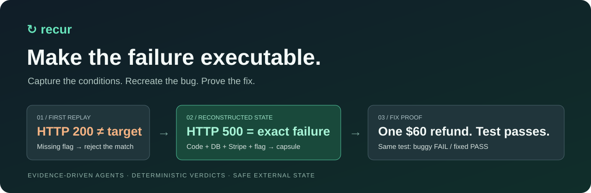
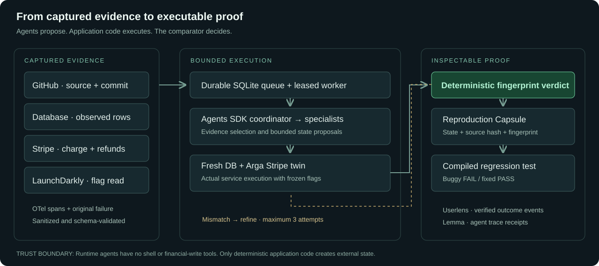
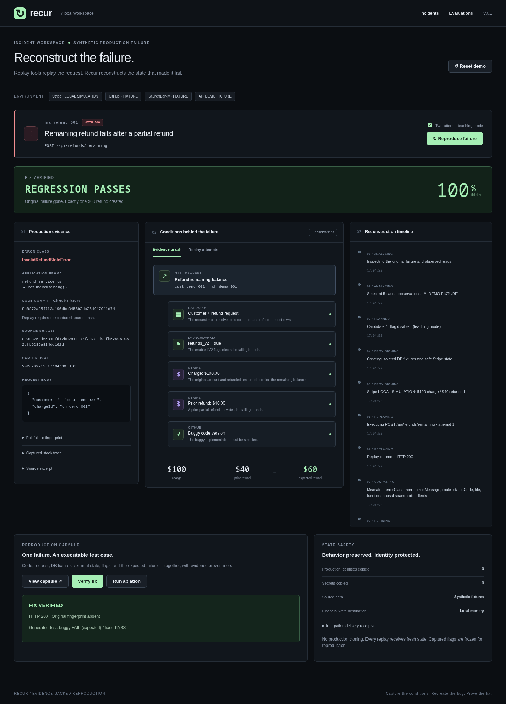

<p align="center"></p>

<p align="center"><strong>A production error is a symptom. Recur turns its missing conditions into an executable test case.</strong></p>
<p align="center"><a href="#run-the-agent">Run the agent</a> · <a href="docs/demo/recur-demo.mp4">Watch the 2-minute demo</a> · <a href="#proof-before-success">Reliability</a> · <a href="docs/YOUR_SETUP.md">Connect your accounts</a> · <a href="docs/ARCHITECTURE.md">Architecture</a></p>

## The problem

The request is identical. The bug is gone. Between the failure and your investigation, a refund changed, a feature flag flipped, or the database moved on. Replaying the HTTP request cannot restore those conditions.

**Recur reconstructs the cross-system state behind a failure**, executes the service in an isolated environment, and accepts success only when a deterministic failure fingerprint matches. The result is a **Reproduction Capsule**: code provenance, request, DB fixtures, external state, flags, and expected failure, ready to replay and turn into a regression test.

The implemented case is deliberately concrete: a **$100 charge**, a **$40 prior refund**, and **`refunds_v2=true`** trigger a buggy branch. Recur recreates that branch, then proves the fixed implementation issues **exactly one $60 refund**.

## Run the agent

**Requirements:** Node.js 22+ and pnpm 10.32.1. A complete local run needs **no credentials**. Dependencies are pinned and locked.

```bash
# From the repository root
pnpm install --frozen-lockfile
cp .env.example .env             # fresh checkout only; preserve existing credentials
pnpm db:migrate
pnpm demo:seed
pnpm dev
```

Open **http://localhost:3000** and click **Reproduce failure**. `pnpm dev` starts the dashboard, durable worker, and demonstration service together. Stop them with Ctrl+C. `pnpm run doctor` reports database, worker, and integration configuration without printing secrets.

Local mode uses deterministic specialist fixtures and simulated Stripe state. Set `OPENAI_API_KEY` and `OPENAI_MODEL` in `.env`, then restart, to run the actual **OpenAI Agents SDK coordinator and specialists**. The timeline and capsule identify which mode actually ran. See [account setup](docs/YOUR_SETUP.md) for GitHub, LaunchDarkly, Arga, Userlens, and Lemma.

### Run through the API

```bash
curl http://localhost:3000/api/incidents/inc_refund_001/reproduce \
  -H 'Content-Type: application/json' \
  -H 'Idempotency-Key: my-first-reproduction' \
  --data '{"teaching":true}'
# Returns HTTP 202 with jobId. Poll /api/jobs/<jobId>.
```

Repeating the same key and input returns the original job. Reusing it for different input returns 409. Refreshing the page does not cancel queued work.

### Replay an exported capsule

```bash
pnpm capsule:replay ./capsule.json
pnpm capsule:replay ./capsule.json fixed
```

Replay uses local simulation and checks capsule integrity and the service source hash. Use the corresponding source checkout. The capsule does not execute arbitrary downloaded code.

## The two-minute demo

**[▶ Watch the captioned 2-minute demo](docs/demo/recur-demo.mp4)** 

Screen recording of the production build in local demo mode. It shows actual service execution and regression results. Stripe is simulated in this recording; live integration acceptance is documented separately.

| Time      | Action                                         | Verification                                                                  |
| --------- | ---------------------------------------------- | -------------------------------------------------------------------------------------------- |
| 0:00–0:15 | Show the incident and five causal observations | A real captured stack, flag evaluation, DB fixtures, charge, and prior refund                |
| 0:15–0:40 | Reproduce with teaching mode enabled           | Attempt 1 returns 200 and is rejected; restoring the observed flag reproduces the target 500 |
| 0:40–0:55 | Open the capsule and export JSON               | State, source hash, evidence IDs, and computed fidelity travel together                      |
| 0:55–1:25 | Verify fix                                     | Original fingerprint absent; exactly one $60 refund; actual Vitest buggy FAIL / fixed PASS   |
| 1:25–1:45 | Run ablation                                   | Removing each of four causal components prevents the target failure                          |
| 1:45–2:00 | Show evaluations and integration receipts      | Negative cases, safe unresolved evidence, and truthful provider delivery status              |

Teaching mode intentionally disables the observed flag on the first attempt to demonstrate mismatch handling. Turn it off for a direct evidence-based reconstruction. It is not a claim that the model naturally makes that mistake.

## Proof before success

Recur's success label is earned by execution, not model confidence.

| Layer            | Enforced behavior                                                                                                                                                |
| ---------------- | ---------------------------------------------------------------------------------------------------------------------------------------------------------------- |
| **Evidence**     | Zod validation; conflicting, missing, or cross-incident observations fail closed                                                                                 |
| **Agents**       | Manager invokes bounded specialists; invented evidence and altered financial state are rejected; no shell or payment tools                                       |
| **Replay**       | Fresh DB and provider state per attempt; integer cents; consistent refund totals; idempotent writes                                                              |
| **Verdict**      | Error class, normalized message, route, status, application file/function, causal spans, and side effects must match                                             |
| **Capsule**      | Canonical SHA-256 integrity check plus source-file hash validation before replay                                                                                 |
| **Regression**   | Model selects structured assertions; trusted template is parsed and executed against both implementations; JSON reports must prove the expected failure and pass |
| **Worker**       | SQLite queue, leases, entity-write fencing, deadlines, persisted results, explicit interrupted status; no automatic replay of ambiguous financial work           |
| **HTTP**         | Bounded strict JSON, idempotency keys, conflict protection, origin checks, token authentication for shared access                                                |
| **Integrations** | Local/connected modes are explicit; analytics delivery receipts distinguish delivered, rejected, unknown, and unconnected                                        |

### Reproduce the validation

```bash
pnpm validate                    # format, types, coverage, scenarios, 200-case sweep, restart checks, build
pnpm exec playwright install chromium
pnpm test:e2e                    # browser → API → worker → DB, isolated test database
pnpm test:live                   # requires configured accounts; writes only to the Arga twin
```

The checked-in [CI workflow](.github/workflows/validate.yml) enforces the local gates and browser suite on every push and pull request. It uploads reports and failed-browser traces. [Verification notes](docs/VERIFICATION.md) distinguish measured local results from live acceptance still requiring credentials.

The ten named scenarios include missing evidence, duplicate evidence, flag off, no refund, full refund, remapped identities, and fixed code. The 200-case seeded sweep varies amounts and branch conditions and checks financial postconditions. **Zero observed false positives in synthetic tests is not a production reliability estimate.** Reports include the sample size and a conditional statistical bound.

## Architecture



The worker runs each job in a separate process. Only deterministic application code provisions external state and evaluates results. The model proposes evidence and assertions; it cannot set the verdict. [Detailed design and operational limits →](docs/ARCHITECTURE.md)

<details>
<summary>View the verified workspace screenshot</summary>



</details>

## Meaningful multi-app integration: Integrated Apps

| Product                | Role in the solution                                                                     | Local fallback                        |
| ---------------------- | ---------------------------------------------------------------------------------------- | ------------------------------------- |
| **GitHub**             | Read commit and allowlisted service source; verify its hash matches execution            | Bundled source + local Git provenance |
| **LaunchDarkly**       | Capture the actual flag evaluation; freeze it for historical replay                      | Explicit fixture flag                 |
| **Arga / Stripe twin** | Reconstruct customer, charge, and partial refunds in one disposable external environment | In-memory Stripe adapter              |
| **OpenAI Agents SDK**  | Coordinator uses EvidenceAnalyst, StateReconstructor, and RegressionAuthor as tools      | Deterministic specialist fixtures     |
| **Userlens**           | Send verified reproduction/fix outcomes for a synthetic account, with delivery receipts  | Recorded “NOT CONNECTED” receipt      |
| **Lemma**              | Export Agents SDK traces for reasoning and tool inspection, with transport receipts      | Recorded “NOT CONNECTED” receipt      |

The integration choices serve reconstruction, outcome measurement, and debugging.

## Operate it

```bash
pnpm build
pnpm start                       # persistent Node deployment, web + worker + demo service
```

Keep the SQLite database and `artifacts/` on persistent storage. `/api/health` checks storage; `/api/ready` also checks a recent worker heartbeat. Shared access requires a random `RECUR_ACCESS_TOKEN` of at least 24 characters. Browser authentication uses HTTP Basic (any username, token as password); API clients can use Bearer authentication. Terminate TLS before exposing it outside your machine.

A [Dockerfile](Dockerfile) and [Compose configuration](compose.yaml) provide a persistent single-host layout. See [operations](docs/ARCHITECTURE.md#operations). This architecture needs a long-running worker and filesystem; it is not a drop-in serverless deployment.

## Scope and honest limits

This is a tested vertical slice for the specified remaining-refund bug, not a generic production incident platform. Both buggy and fixed branches are bundled; Recur verifies the supplied fix rather than writing a patch. It does not clone production accounts, ingest arbitrary repositories, or infer arbitrary dependencies.

A source hash identifies one service file, not every dependency in a deployment. Capsule SHA-256 detects modification; it is **not a signature proving authorship**. Authentication is a shared workspace token, not multi-tenant RBAC. Analytics delivery is best-effort and never establishes reproduction correctness. Live service availability and real model behavior require the separate credentialed acceptance run.

**What leaves the run is useful:** an inspectable failure, its causal state, a portable capsule, and a regression test a developer or coding agent can act on.
